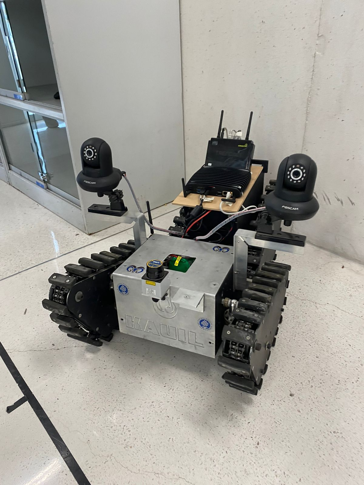

# Kauil
Repository for rescue robot.

 

## Index 
- [Kauil](#kauil)
  - [Index](#index)
  - [Folders](#folders)
  - [Installation](#installation)
  - [Use](#use)
  - [Authors](#authors)
  - [Project status](#project-status)
## Folders
- Arduino
  - Code and tests for Arduinos in Kauil.
- catkin_ws
  - Catkin workspace in Kauil.
- misc
  - Miscellaneous information of the project.

<a href="#kauil">Go to top</a>

## Installation
Download the Arduino files into the Arduinos and cone the repository into Kauil and pass the packages into Kauil's `~/catkin_ws/src` and in `~/catkin_ws` run `catkin_make`.

<a href="#kauil">Go to top</a>

## Use
1. Connect all batteries to Kauil.

## Authors
- [Nancy García Jiménez](https://github.com/nansnova)
- [D. Alberto Anaya Márquez](https://github.com/A01379375) 
- [Alejandro Domínguez Lugo](https://github.com/AlDomL9)

<a href="#kauil">Go to top</a>

## Project status
Project in development. Week 6/10

<a href="#kauil">Go to top</a>

